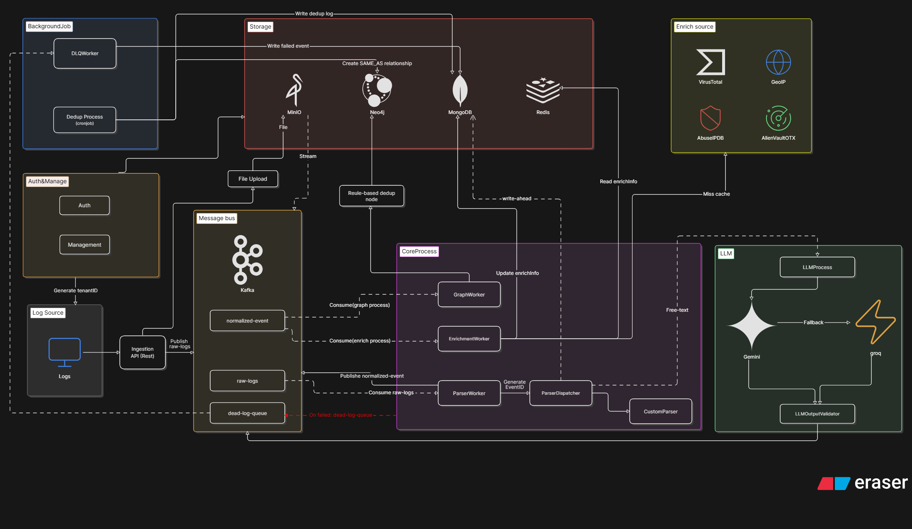

# SOC Entity Management

Hệ thống là một nền tảng quản lý và phân tích thực thể an ninh mạng (Security Entity Intelligence Platform) được thiết kế nhằm hỗ trợ Security Operations Center (SOC) trong việc thu thập, chuẩn hóa, làm giàu và phân tích dữ liệu bảo mật từ nhiều nguồn khác nhau.

Nền tảng tiếp nhận log, alert và sự kiện bảo mật từ các hệ thống như EDR, SIEM, Firewall, IDS/IPS và Cloud Audit Logs. Dữ liệu sau khi được thu thập sẽ đi qua kiến trúc xử lý theo hướng event-driven sử dụng Kafka, nơi các sự kiện được chuẩn hóa định dạng, trích xuất thực thể (Entity Extraction), làm giàu thông tin (Enrichment) và xây dựng các mối quan hệ bảo mật.

Các thực thể như User, Host, IP Address, Domain và File Hash được lưu trữ dưới dạng đồ thị trong Neo4j, cho phép mô hình hóa các mối quan hệ và hành vi liên quan đến tấn công mạng. Thông qua cơ sở dữ liệu đồ thị, hệ thống hỗ trợ truy vết chuỗi tấn công, phân tích liên kết giữa các thực thể, xác định điểm xâm nhập và hỗ trợ điều tra sự cố an ninh hiệu quả hơn.

Bên cạnh đó, nền tảng cung cấp khả năng trực quan hóa quan hệ dưới dạng graph, hỗ trợ tìm kiếm và truy vấn đa bước giữa các thực thể, giúp chuyên gia SOC nhanh chóng phát hiện các mẫu hành vi bất thường và đánh giá phạm vi ảnh hưởng của một sự kiện bảo mật.

**Tech stack:** Java 21 · Spring Boot 3.5 · React + Vite · Kafka · MongoDB · Neo4j · Redis · MinIO

---

## Kiến trúc hệ thống

<!-- ```
  Browser / API Client
         │
         │  POST /api/v1/ingest   (text/plain — free text)
         │  POST /api/files/upload (multipart — log file)
         ▼
  ┌─────────────────┐
  │  Ingestion API  │  → lưu raw log vào MongoDB (audit_logs)
  └────────┬────────┘
           │ publish
           ▼
   Kafka: raw-logs
           │
           ▼
  ┌────────────────────────────────────────────────────┐
  │  ParserWorker  (soc-parser-group)                  │
  │                                                    │
  │  JSON structured  →  detect format → parse         │
  │  Free text        →  LLM (Gemini → Groq → Mock)   │
  │                       → parse → normalize          │
  │  lỗi → Kafka: dead-letter-queue                   │
  └────────────────────┬───────────────────────────────┘
                       │ publish
                       ▼
           Kafka: normalized-events
                  ┌────┴────┐
                  ▼         ▼
  ┌─────────────────┐   ┌──────────────────────────────────┐
  │ EnrichmentWorker│   │ GraphWorker  (soc-graph-group)   │
  │ (soc-enrich..)  │   │                                  │
  │ IP  → GeoIP +   │   │ GraphEntityService → MERGE       │
  │      AbuseIPDB  │   │   entities + relationships       │
  │      + OTX      │   │   vào Neo4j (chỉ identity,       │
  │ Hash → VT       │   │   KHÔNG lưu enrichment fields)   │
  │                 │   │ lỗi → dead-letter-queue          │
  │ → lưu enrichment│   └──────────────────────────────────┘
  │   vào MongoDB   │
  │   (audit_logs)  │
  │ lỗi → DLQ      │
  └─────────────────┘

  UI muốn hiển thị enrichment của entity:
    GET /api/enrichment/entity?type=ip&value=1.2.3.4
    → query MongoDB audit_logs → trả về {geo, ipIntel, malware, ...}
    (tách biệt: Neo4j = graph topology, MongoDB = enrichment data)

  Background job (mỗi ~2 phút):
  GraphDeduplicationService → SAME_AS links + MongoDB: graph_dedup_log
``` -->



---


## Workflow


```
                +------------------+
                | API / File Upload|
                +---------+--------+
                          |
                          v
                +------------------+
                |     MongoDB      |
                | (Raw Log Store)  |
                +------------------+
                          |
                          v
                +------------------+
                | Kafka: raw-logs  |
                +------------------+
                          |
                          v
                +------------------+
                |   ParserWorker   |
                +------------------+
                          |
                          v
                +----------------------+
                | Kafka: normalized-   |
                |       events         |
                +----------------------+
                    |              |
                    |              |
                    v              v
          +----------------+  +----------------+
          |EnrichmentWorker|  |  GraphWorker   |
          +----------------+  +----------------+
                    |              |
                    v              v
          +----------------+  +----------------+
          |    MongoDB     |  |     Neo4j      |
          | Enrichment DB  |  | Entity Graph   |
          +----------------+  +----------------+
                                    |
                                    v
                    +---------------------------+
                    | GraphDeduplicationService |
                    |      (every 2 min)        |
                    +---------------------------+
                                    |
                                    v
                           SAME_AS Relationships
                                    |
                                    v
                    +---------------------------+
                    |      REST API / UI        |
                    +---------------------------+
                                    |
                                    v
                         Investigation & Hunting
```


1. **Ingestion**

   * Nhận Logs/Alerts từ API hoặc File Upload.
   * Lưu log gốc vào MongoDB.
   * Đẩy log vào Kafka topic `raw-logs`.

2. **Normalization & Entity Extraction**

   * ParserWorker đọc dữ liệu từ `raw-logs`.
   * Chuẩn hóa dữ liệu (trim, lowercase, chuẩn hóa field).
   * Trích xuất các entity:

     * User
     * IP Address
     * Hostname
     * Domain
     * File
     * URL
   * Đẩy kết quả vào Kafka topic `normalized-events`.

3. **Enrichment**

   * EnrichmentWorker đọc từ `normalized-events`.
   * Gọi các nguồn Threat Intelligence:

     * VirusTotal
     * AbuseIPDB
     * GeoIP
   * Lưu dữ liệu làm giàu vào MongoDB.

4. **Graph Construction**

   * GraphWorker đọc dữ liệu đã chuẩn hóa.
   * Tạo Entity Nodes trong Neo4j.
   * Tạo Relationship giữa các Entity.
   * Chỉ lưu danh tính và quan hệ, không lưu enrichment data.

5. **Deduplication**

   * Chạy định kỳ mỗi 2 phút.
   * Tìm các entity trùng lặp.
   * Tạo quan hệ `SAME_AS`.
   * Hỗ trợ điều tra xuyên nhiều nguồn log.


## Kafka Topics

| Topic               | Producer          | Consumer                          |
|---------------------|-------------------|-----------------------------------|
| `raw-logs`          | Ingestion API     | ParserWorker                      |
| `normalized-events` | ParserWorker      | EnrichmentWorker + **GraphWorker** |
| `dead-letter-queue` | bất kỳ worker nào | DlqWorker → MongoDB `dlq_events`  |

---

## Entity Types & Properties

| Label           | ID Property    | Properties khác (trong Neo4j)                           |
|-----------------|----------------|---------------------------------------------------------|
| `User`          | `username`     | —                                                       |
| `Host`          | `hostname`     | —                                                       |
| `IP`            | `address`      | — *(enrichment lấy từ MongoDB)*                         |
| `Domain`        | `name`         | —                                                       |
| `FileHash`      | `hash`         | — *(enrichment lấy từ MongoDB)*                         |
| `Url`           | `url`          | —                                                       |
| `Process`       | `name`         | `path`, `commandLine`                                   |
| `CloudResource` | `resourceId`   | —                                                       |
| `Email`         | `address`      | —                                                       |
| `Cve`           | `cveId`        | —                                                       |

> **Enrichment data** (country, ASN, abuseScore, threatLevel, verdict, family…) được lưu riêng trong MongoDB collection `audit_logs` (field `enrichment`). UI query qua `GET /api/enrichment/entity?type=ip&value=...` thay vì đọc từ Neo4j node properties.

---

## Relationships

| Relationship       | From          | To              | Nguồn event                              |
|--------------------|---------------|-----------------|------------------------------------------|
| `LOGGED_IN_TO`     | User          | Host            | AuthenticationEvent                      |
| `AUTHENTICATED_TO` | IP            | Host            | AuthenticationEvent (khi có IP)          |
| `EXECUTED_ON`      | FileHash      | Host            | ProcessEvent                             |
| `EXECUTED_ON`      | Process       | Host            | ProcessEvent / AlertEvent                |
| `HASH_OF`          | FileHash      | Process         | ProcessEvent (khi có cả hash và name)    |
| `CONNECTED_TO`     | IP            | IP              | NetworkEvent                             |
| `RESOLVES_TO`      | IP            | Domain          | NetworkEvent / AlertEvent                |
| `ALERTED_FROM`     | User          | IP              | AlertEvent                               |
| `TARGETED_AT`      | IP            | Host            | AlertEvent                               |
| `DETECTED_ON`      | FileHash      | IP              | AlertEvent                               |
| `ACCESSED`         | IP            | Url             | AlertEvent                               |
| `ACCESSED`         | User          | CloudResource   | AlertEvent                               |
| `HAS_EMAIL`        | User          | Email           | AlertEvent                               |
| `AFFECTS`          | Cve           | Host            | AlertEvent                               |
| `SAME_AS`          | Node          | Node            | GraphDeduplicationService (background)   |

Tất cả relationship đều có: `firstSeen`, `lastSeen`, `count`, `firstEventId`, `lastEventId`.

---


### Normalization (EntityNormalizer)

| Loại      | Quy tắc                                                        |
|-----------|----------------------------------------------------------------|
| username  | lowercase; bỏ `DOMAIN\` prefix                                 |
| ip        | bỏ `::ffff:` IPv4-mapped IPv6 prefix                           |
| hash      | lowercase, trim                                                |
| hostname  | lowercase, bỏ trailing `.`                                     |
| domain    | lowercase, bỏ trailing `.`                                     |
| url       | lowercase, bỏ trailing `/`                                     |
| email     | lowercase, trim                                                |
| cveId     | uppercase canonical (`CVE-YYYY-NNNNN`)                         |
| processName | basename extraction (`C:\...\cmd.exe` → `cmd.exe`), lowercase |


## Entity Deduplication (SAME_AS)

`GraphDeduplicationService` chạy định kỳ (mặc định 2 phút), tạo `SAME_AS` link giữa các entity có thể là cùng một thực thể:

| Rule              | Ví dụ                                         | Confidence |
|-------------------|-----------------------------------------------|------------|
| `email_prefix`    | `nghia` ↔ `nghia@company.vn`                  | 85%        |
| `fqdn_shortname`  | `WIN-PC01` ↔ `WIN-PC01.corp.local`            | 80%        |

Mỗi link mới được ghi vào MongoDB collection `graph_dedup_log`.
---

## Parsers

| Parser               | EventType      | Input format                                    |
|----------------------|----------------|-------------------------------------------------|
| WindowsEventParser   | AUTHENTICATION | Windows Event Log JSON (event_id 4624/4625)     |
| NetworkEventParser   | NETWORK        | Firewall / flow JSON                            |
| ProcessEventParser   | PROCESS        | Sysmon / EDR process event JSON                 |
| AlertEventParser     | ALERT          | Generic alert JSON                              |
| LLM fallback         | bất kỳ         | Free text — Gemini → Groq → Mock (offline safe) |

---

## Enrichment Sources

| Nguồn      | Đối tượng    | Dữ liệu thu được                            |
|------------|--------------|---------------------------------------------|
| GeoIP      | IP address   | country, city, ASN                          |
| AbuseIPDB  | IP address   | abuseScore (0–100), isMalicious             |
| OTX        | IP / Domain  | threatLevel (NONE/LOW/MEDIUM/HIGH/CRITICAL) |
| VirusTotal | SHA-256 hash | verdict (MALICIOUS/CLEAN/UNKNOWN), family   |

---

## MongoDB Collections

| Collection        | Nội dung                                             |
|-------------------|------------------------------------------------------|
| `audit_logs`      | Raw log gốc trước khi parse, lưu ngay khi nhận vào  |
| `graph_dedup_log` | Log mỗi SAME_AS link mới được tạo bởi dedup job     |

---

## Project Structure

```
src/main/java/com/viettelDigitalTalent/EntitiyManagement/
├── common/                 # Utils chung
│   └── utils/
├── config/                 # Security, CORS, Kafka/Redis/MinIO/Neo4j/Async config
├── enrichment/             # Làm giàu dữ liệu
│   ├── core/               # EnrichmentService, EnrichmentProvider
│   ├── dtos/               # GeoInfo, IpIntelInfo, MalwareInfo
│   ├── geoip/              # GeoIP lookup
│   ├── ipintel/            # AbuseIPDB, OTX, Whois, mock providers
│   └── threatintel/        # VirusTotal, mock provider
├── graph/                  # Neo4j entity graph
│   ├── controller/         # GraphController
│   ├── dto/                # NodeDto, EdgeDto, GraphResponse, PathResponse
│   └── service/            # GraphEntityService, GraphQueryService, dedup, normalizer
├── ingestion/              # Nhận log trực tiếp và file ingestion
│   ├── controller/
│   ├── dto/
│   └── service/
├── llm/                    # LLM fallback cho free-text
│   └── core/               # Gemini, Groq, Mock, prompt, validator, process
├── management/             # Auth, JWT, MinIO/file, enrichment/threat-intel APIs
│   ├── controller/
│   ├── dto/
│   ├── filter/
│   └── service/
├── normalize/              # Event data models
│   ├── alert/
│   ├── base/
│   └── event/
├── parser/                 # Parser raw log -> BaseEvent
│   ├── alert/
│   ├── core/
│   ├── network/
│   ├── process/
│   └── windows/
├── queue/                  # Kafka topics, publisher, workers, DLQ controller
│   ├── config/
│   ├── controller/
│   ├── publisher/
│   └── worker/
└── storage/                # MongoDB documents + repositories
    ├── mongodb/
    └── repository/

frontend/src/
├── pages/
│   ├── LoginPage.jsx
│   ├── RegisterPage.jsx
│   ├── EntityListPage.jsx      # Danh sách entity
│   ├── EntityDetailPage.jsx    # Chi tiết entity + graph neighbors/enrichment
│   ├── PathFinderPage.jsx      # Tìm attack path
│   └── DlqPage.jsx             # Dead letter queue UI
├── components/
│   ├── EntityBadge.jsx
│   ├── GraphView.jsx
│   └── UploadPanel.jsx         # File upload + free-text/JSON input
├── api.js                      # Fetch wrappers chính cho frontend
├── App.jsx                     # Router + protected routes + navbar
├── App.css
├── index.css
└── main.jsx
```

---

## Cách chạy

### Yêu cầu

| Tool                  | Version  |
|-----------------------|----------|
| Java                  | 21+      |
| Maven                 | 3.8+     |
| Node.js               | 18+      |
| Docker & Docker Compose | latest |

### 1 — Khởi động Infrastructure

```bash
docker-compose up -d
```

| Service    | Port(s)        | Mục đích                    |
|------------|----------------|-----------------------------|
| Kafka      | 9092           | Message streaming           |
| Zookeeper  | 2181           | Kafka coordinator           |
| MongoDB    | 27017          | Raw logs + dedup log        |
| Redis      | 6379           | Enrichment cache            |
| MinIO      | 9000 / 9001    | File object storage         |
| Neo4j      | 7474 / 7687    | Graph database              |
| Prometheus | 9090           | Metrics scraping            |
| Grafana    | 3000           | Monitoring dashboard        |

```bash
docker-compose ps   # kiểm tra status
```

### 2 — Khởi động Backend

```bash
mvn spring-boot:run
```

Backend: **http://localhost:8080**

### 3 — Khởi động Frontend

```bash
cd frontend
npm install   # chỉ lần đầu
npm run dev
```

Frontend: **http://localhost:5173**

---

## Tạo test data

```bash
python3 genLog.py
```

Tạo ra:

| File               | Nội dung                                                     |
|--------------------|--------------------------------------------------------------|
| `soc_logs.json`    | ~1000 structured events (NDJSON) — upload qua File Upload    |
| `soc_freetext.txt` | 25 free-text alert templates — dán vào Free Text panel       |

**Coverage:**
- AUTH events: User + Host + IP nodes, bao gồm FQDN và email usernames để trigger SAME_AS dedup
- PROCESS events: FileHash + Process nodes, ~40% reuse known hashes để test `ON MATCH SET`
- NETWORK events: IP→IP CONNECTED_TO, IP→Domain RESOLVES_TO
- ALERT events: tất cả 10 entity types, đặc biệt có 1 `full_blast` alert với đủ hết entity fields
- Free text: brute-force, malware/LOLBIN, C2/DNS tunneling, phishing, cloud exfiltration, CVE exploit, APT chain

```bash
# Upload structured logs
curl -X POST http://localhost:8080/api/files/upload \
  -F "file=@soc_logs.json"

# Hoặc dùng UI: mở http://localhost:5173 → kéo thả soc_logs.json vào File Upload panel
# Copy từng dòng trong soc_freetext.txt → dán vào ô "Nhập Alert (Free Text)" → Gửi Alert
```

---

## API Reference

### Ingestion

```bash
# Free text (LLM parse)
POST /api/v1/ingest
Content-Type: text/plain

Phát hiện đăng nhập đáng ngờ từ IP 185.220.101.42 vào WIN-DC01 lúc 3 giờ sáng

# File upload (NDJSON — mỗi dòng 1 event)
POST /api/files/upload
Content-Type: multipart/form-data

file=@soc_logs.json
```

### Graph Query

```bash
# Danh sách entity theo loại
GET /api/graph/entities/{type}
# type: user | host | ip | domain | filehash | url | process | cloudresource | email | cve

# Neighbor nodes (1–5 hops)
GET /api/graph/{type}/{value}/neighbors?hops=2

# Attack path
GET /api/graph/path?fromType=user&fromValue=nghia&toType=ip&toValue=185.220.101.42&maxHops=4
```

### Enrichment Query (MongoDB)

```bash
# Lấy enrichment data của một entity từ audit_logs
GET /api/enrichment/entity?type=ip&value=185.220.101.42
GET /api/enrichment/entity?type=filehash&value=abc123def456...

# Response ví dụ (IP):
# {
#   "geo":    { "country": "DE", "city": "Frankfurt", "asn": "AS396356" },
#   "ipIntel":{ "abuseScore": 92, "threatLevel": "CRITICAL", "malicious": true }
# }
```

---

## Endpoints UI & Monitoring

| URL                                        | Mô tả                                      |
|--------------------------------------------|---------------------------------------------|
| http://localhost:5173                      | Frontend — danh sách entity + graph         |
| http://localhost:8080/swagger-ui.html      | Swagger UI                                  |
| http://localhost:8080/actuator/health      | Health check                                |
| http://localhost:8080/actuator/prometheus  | Prometheus metrics                          |
| http://localhost:9090                      | Prometheus UI                               |
| http://localhost:3000                      | Grafana (admin / admin)                     |
| http://localhost:7474                      | Neo4j Browser (neo4j / password123)         |
| http://localhost:9001                      | MinIO Console (admin / password123)         |

### Neo4j Quick Queries

```cypher
-- Xem toàn bộ graph (giới hạn 100 node)
MATCH (n)-[r]->(m) RETURN n, r, m LIMIT 100

-- Xem các SAME_AS dedup links
MATCH (a)-[r:SAME_AS]->(b) RETURN a, r, b

-- User tấn công từ IP nào
MATCH (u:User)-[r:ALERTED_FROM]->(ip:IP) RETURN u.username, ip.address, r.alertName

-- CVE nào ảnh hưởng host nào
MATCH (cve:Cve)-[:AFFECTS]->(h:Host) RETURN cve.cveId, h.hostname

-- Attack path ngắn nhất
MATCH path = shortestPath((u:User {username:'nghia'})-[*1..5]-(ip:IP {address:'185.220.101.42'}))
RETURN path
```

### Grafana Dashboard "SOC Entity Management"

- **Entity Saved** — số entity ghi vào Neo4j theo event type
- **Events Processed** — tổng event qua Kafka pipeline
- **Enrichment Duration** — latency p50/p99 bước làm giàu
- **HTTP Request Rate / Error Rate** — traffic vào REST API
- **JVM Memory, GC, Thread count** — sức khoẻ JVM

---

## Dừng hệ thống

```bash
docker-compose down        # dừng
docker-compose down -v     # dừng + xóa toàn bộ data
```

---

## Deploy K8s (local — minikube)

### Yêu cầu

```bash
# Cài minikube
brew install minikube

# Cài helm (chỉ cần nếu dùng Helm)
brew install helm
```

---

### Cách 1 — Plain Manifest

Dùng thư mục `k8s/` với `kubectl apply` trực tiếp.

```bash
# 1. Start minikube
minikube start --memory=8192 --cpus=4
minikube addons enable ingress

# 2. Build image vào minikube (không cần push Docker Hub)
eval $(minikube docker-env)
docker build -t soc/backend:latest .
cd frontend && docker build -t soc/frontend:latest . && cd ..

# 3. Sửa imagePullPolicy trong backend.yaml và frontend.yaml thành Never
#    (để minikube dùng local image thay vì pull từ registry)
sed -i '' 's/pullPolicy: IfNotPresent/pullPolicy: Never/' k8s/backend.yaml k8s/frontend.yaml

# 4. Deploy theo thứ tự
kubectl apply -f k8s/00-namespace.yaml
kubectl apply -f k8s/01-secrets.yaml
kubectl apply -f k8s/02-configmap.yaml
kubectl apply -f k8s/redis.yaml -f k8s/mongodb.yaml -f k8s/neo4j.yaml
kubectl apply -f k8s/kafka.yaml -f k8s/minio.yaml
kubectl apply -f k8s/backend.yaml -f k8s/frontend.yaml
kubectl apply -f k8s/ingress.yaml

# 5. Kiểm tra pods
kubectl get pods -n soc

# 6. Trỏ domain local
echo "$(minikube ip)  soc.local" | sudo tee -a /etc/hosts
```

Mở **http://soc.local** trên browser.

---

### Cách 2 — Helm Chart

Dùng thư mục `helm/soc-app/` cho backend + frontend.  
Infrastructure (MongoDB, Kafka, Redis, Neo4j, MinIO) dùng Bitnami Helm chart có sẵn.

```bash
# 1. Start minikube
minikube start --memory=8192 --cpus=4
minikube addons enable ingress

# 2. Build image vào minikube
eval $(minikube docker-env)
docker build -t soc/backend:latest .
cd frontend && docker build -t soc/frontend:latest . && cd ..

# 3. Thêm Bitnami repo
helm repo add bitnami https://charts.bitnami.com/bitnami
helm repo update

# 4. Tạo namespace
kubectl create namespace soc

# 5. Cài infrastructure bằng Bitnami
helm install mongodb bitnami/mongodb -n soc \
  --set auth.rootPassword=root \
  --set auth.rootUser=root

helm install redis bitnami/redis -n soc \
  --set auth.enabled=false

helm install kafka bitnami/kafka -n soc \
  --set listeners.client.protocol=PLAINTEXT \
  --set controller.replicaCount=1

helm install neo4j neo4j/neo4j -n soc \
  --set neo4j.password=password123 \
  --set volumes.data.mode=defaultStorageClass

helm install minio bitnami/minio -n soc \
  --set auth.rootUser=admin \
  --set auth.rootPassword=password123

# 6. Cài app (backend + frontend)
helm install soc-app helm/soc-app -n soc \
  --set backend.pullPolicy=Never \
  --set frontend.pullPolicy=Never

# 7. Kiểm tra
kubectl get pods -n soc
helm list -n soc

# 8. Trỏ domain
echo "$(minikube ip)  soc.local" | sudo tee -a /etc/hosts
```

Mở **http://soc.local** trên browser.

#### Cập nhật app (sau khi sửa code)

```bash
eval $(minikube docker-env)
docker build -t soc/backend:latest .      # rebuild
helm upgrade soc-app helm/soc-app -n soc  # rolling update
```

#### Gỡ cài đặt

```bash
# Helm
helm uninstall soc-app mongodb redis kafka neo4j minio -n soc

# Manifest
kubectl delete -f k8s/

# Xóa toàn bộ
kubectl delete namespace soc
minikube stop
```
